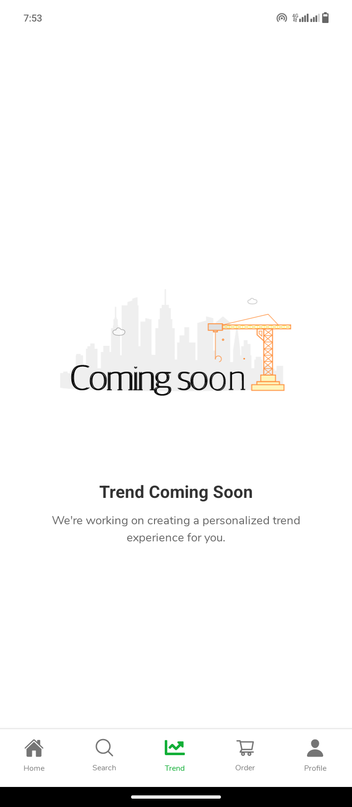

# Product Search Catalog - Mobile App

## Project Overview

This is a mobile application developed for showcasing a product search catalog with advanced search and categorization features. The app is built using Expo and React Native, integrating with the Fake Store API to provide a comprehensive product browsing experience.

Note: You can get the apk in the apk folder directory.

## Project Highlights

- 🚀 Developed using Expo Go and React Native
- 🛍️ Product search across multiple categories
- 🔍 Advanced search functionality
- 💾 Persistent search history

## Tech Stack

- **Framework**: Expo (React Native)
- **API**: Fake Store API (https://fakestoreapi.com/)
- **Design**: Figma Design Reference

## Key Features

1. **Dynamic Category Mapping**

   - Map API categories to custom UI categories
   - Flexible product and category representation

2. **Search Functionality**

   - Real-time product and category search
   - Comprehensive result display
   - Persistent search history

3. **UI/UX**
   - Responsive design
   - Intuitive navigation
   - Smooth transitions and animations

## Screenshots

<div style="display: flex; justify-content: space-between;">
  
  
  
  
  
  
  
  
</div>

## Getting Started

### Prerequisites

- Node.js (v16+)
- npm or Yarn
- Expo CLI

1. Install dependencies

   ```bash
   npm install or npm install --legacy-peer-deps
   ```

2. Start the app

   ```bash
    npx expo start
   ```

In the output, you'll find options to open the app in a

- [development build](https://docs.expo.dev/develop/development-builds/introduction/)
- [Android emulator](https://docs.expo.dev/workflow/android-studio-emulator/)
- [iOS simulator](https://docs.expo.dev/workflow/ios-simulator/)
- [Expo Go](https://expo.dev/go), a limited sandbox for trying out app development with Expo

You can start developing by editing the files inside the **app** directory. This project uses [file-based routing](https://docs.expo.dev/router/introduction).

## Get a fresh project

When you're ready, run:

```bash
npm run reset-project
```

This command will move the starter code to the **app-example** directory and create a blank **app** directory where you can start developing.

## Learn more

To learn more about developing your project with Expo, look at the following resources:

- [Expo documentation](https://docs.expo.dev/): Learn fundamentals, or go into advanced topics with our [guides](https://docs.expo.dev/guides).
- [Learn Expo tutorial](https://docs.expo.dev/tutorial/introduction/): Follow a step-by-step tutorial where you'll create a project that runs on Android, iOS, and the web.

## Join the community

Join our community of developers creating universal apps.

- [Expo on GitHub](https://github.com/expo/expo): View our open source platform and contribute.
- [Discord community](https://chat.expo.dev): Chat with Expo users and ask questions.
